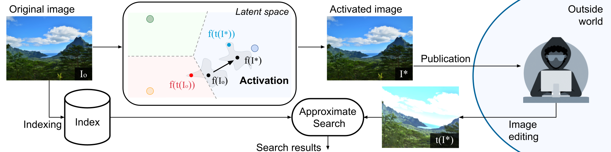

# :pushpin: Active Image Indexing

PyTorch/FAISS implementation and pretrained models for the paper.
For details, see [**Active Image Indexing**](https://arxiv.org/abs/2210.10620).  

If you find this repository useful, please consider giving a star :star: and please cite as:

```
@inproceedings{fernandez2022active,
  title={Active Image Indexing},
  author={Fernandez, Pierre and Douze, Matthijs and Jégou, Hervé and Furon, Teddy},
  booktitle={International Conference on Learning Representations (ICLR)},
  year={2023}
}
```

[[`Webpage`](https://pierrefdz.github.io/publications/activeindexing/)]
[[`arXiv`](https://arxiv.org/abs/2210.10620)]
[[`OpenReview`](https://openreview.net/forum?id=K9RHxPpjn2)]


## Introduction

<div align="center">
  
</div>


## Usage


### Requirements

First, clone the repository locally and move inside the folder:
```cmd
git clone https://github.com/facebookresearch/active_indexing.git
cd active_indexing
```
To install the main dependencies, we recommand using conda.
[PyTorch](https://pytorch.org/) and [Faiss](https://github.com/facebookresearch/faiss/blob/main/INSTALL.md) can be installed with:
```cmd
conda install -c pytorch torchvision pytorch==1.11.0 cudatoolkit=11.3
conda install -c conda-forge faiss-gpu==1.7.2
```
Then, install the remaining dependencies with:
```cmd
pip install -r requirements.txt
```
This codebase has been developed with python version 3.8, PyTorch version 1.11.0, CUDA 11.3 and FAISS 1.7.2.


### Data preparation

Experiments are done on DISC21.
It is available for download at https://ai.facebook.com/datasets/disc21-dataset/.

The dataset is composed of:
- 1M training images
- 1M reference images
- 50k query images, 10k of which came from the reference set.

We assume the dataset has been organized as follows:
```
DISC21
├── train
│   ├── T000000.jpg
│   ├── ...
│   └── T999999.jpg
├── references
│   ├── R000000.jpg
│   ├── ...
│   └── R999999.jpg
└── dev_queries_groundtruth.csv
```

We then provide a script to extract the 10k reference images that are used as queries in the dev set thanks to the ground-truth file:
```
python data/prepare_disc.py --data_path path/to/DISC21 --output_dir path/to/DISC21
```
This will create new folders (note that only symlinks are created, the images are not duplicated):
- `DISC21/ref_10k` containing the 10k reference images used as queries in the dev set
- `DISC21/ref_990k` folder containing the remaining 990k reference images
- `DISC21/queries_40k` folder containing 40k additional query images that are not in the reference set (contrary to the paper, we take images from DISC training set instead of the original images of the query dev set before augmentation - for legal convenience).


### Feature extractor models

TODO: put links on AWS
- /checkpoint/pfz/watermarking/models/dino_r50/dino_r50_pretrain.torchscript.pt
- /checkpoint/pfz/watermarking/models/isc/isc1.torchscript.pt
- same for vit-s


We provide the links to some models used as feature extractors:
| Name          | Trunk           | Dimension | TorchVision       |
|---|---|---|---|
| sscd_disc_advanced  | ResNet-50   | 512  | [link](https://dl.fbaipublicfiles.com/sscd-copy-detection/sscd_disc_advanced.torchscript.pt) |
| sscd_disc_large     | ResNeXt101  | 1024 | [link](https://dl.fbaipublicfiles.com/sscd-copy-detection/sscd_disc_large.torchscript.pt) |
| dino_r50            | ResNet-50   | 1024 | [link]() |
| dino_vits           | ViT-s       | 1024 | [link]() |
| isc_dt1             | EffNetv2    | 1024 | [link]() |

There are standalone TorchScript models that can be used in any pytorch project without any code corresponding to the networks.

For example, to use the `sscd_disc_advanced` model:
```cmd
mkdir -p models
wget https://dl.fbaipublicfiles.com/sscd-copy-detection/sscd_disc_advanced.torchscript.pt -O models/sscd_disc_advanced.torchscript.pt
```

Other links:
- SSCD: https://github.com/facebookresearch/sscd-copy-detection/
- DINO: https://github.com/facebookresearch/dino
- ISC-dt1: https://github.com/lyakaap/ISC21-Descriptor-Track-1st


### Feature extraction

We provide a simple script to extract features from a given model and a given image folder.
The features are extracted from the last layer of the model.
```
python extract_fts.py --model_name torchscript --model_path path/to/model --data_dir path/to/folder --output_dir path/to/output
```
This will save in the `--output_dir` folder: 
- `fts.pt`: the features in a torch file, 
- `filenames.txt`: a file containing the list of filenames corresponding to the features.

By default, images are resized to $288 \times 288$ (it can be changed with the `--resize_size` argument). 

To make things faster, the rest of the code assumes that features of the `DISC21/training` and `DISC21/ref_990k` image folders are pre-computed and saved in new folders.


### Active Indexing

To reproduce main results of the paper, use the following command:
```cmd

```

## License

active_indexing is CC-BY-NC licensed, as found in the LICENSE file.

