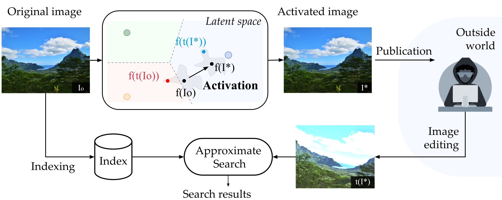

# :pushpin: Active Image Indexing

PyTorch/FAISS implementation and pretrained models for the paper.
For details, see [**Active Image Indexing**](https://arxiv.org/abs/2210.10620).  

If you find this repository useful, please consider giving a star :star: and please cite as:

```
@inproceedings{fernandez2022active,
  title={Active Image Indexing},
  author={Fernandez, Pierre and Douze, Matthijs and Jégou, Hervé and Furon, Teddy},
  booktitle={International Conference on Learning Representations (ICLR)},
  year={2023}
}
```

[[`Webpage`](https://pierrefdz.github.io/publications/activeindexing/)]
[[`arXiv`](https://arxiv.org/abs/2210.10620)]
[[`OpenReview`](https://openreview.net/forum?id=K9RHxPpjn2)]


## Introduction

<div align="center">
  
</div>


## Usage

First, clone the repository locally and move inside the folder:
```
git clone https://github.com/facebookresearch/active_indexing.git
cd ssl_watermarking
```
Then, install the dependencies:
```
pip install -r requirements.txt
```
This codebase has been developed with python version 3.8, PyTorch version 1.10.2, CUDA 10.2 and torchvision 0.11.3.
The following considers `active_indexing/` as the root folder, all paths are relative to it.

## License

active_indexing is CC-BY-NC licensed, as found in the LICENSE file.

